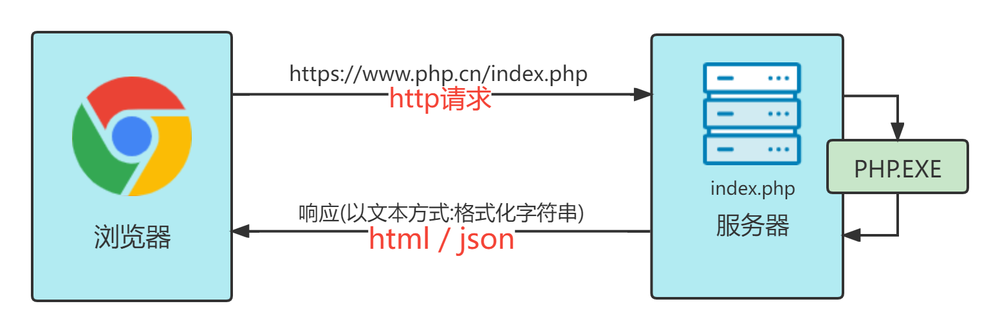

# 1220 教学内容

## 1. 如果学习

- 上课: php 中文网直播间
- 回看: 前端<https://www.php.cn/course/1345.html>
- 作业: 本站博客,请使用`markdown`语法编写

---

## 2. 开发环境

- 编辑器: vscode, <https://code.visualstudio.com/>
- 浏览器: chrome, <https://www.google.cn/chrome/>
- 操作系统: windows10

> vscode,chrome 是跨平台,免费软件,macos,linux 均可免费下载使用

---

## 3. vscode 常用插件与字体

- 1.通用

  - `chinese(simplified ...)`: 简体中文语言包
  - `live server`: 实时预览
  - `prettier-code formatter`: 最流行的代码格式化插件
  - `better comments`: 自定义注释颜色
  - `path intellisense`:路径自动感知填充
  - `helium icon theme`: 一款我喜欢的文件图标主题
  - `one dark pro`: 经典的主题,使用者众多,很耐看
  - `material theme`: 经典"材料"主题,
  - `material theme icons` 常与`material theme`配置的文件图标
  - `shades of purple`: 赛博朋克风格的一款主题,很明亮风骚
  - `dracula official`: 经典的吸血鬼主题
  - `dracula at night`: 个人更喜欢这款小众的吸血鬼暗黑版(教学用它)
  - `code runner`: 几乎可以快速运行常见的所有语言,如`php,java,js...`
  - `codesnap`: 快速生成苹果电脑风格的代码片断截图,分享时使用

- 2.markdown

  - `markdown preview...`: markdown 实时预览
  - `markdownlint`: markdown 语法检查器

- 3.html/css

  - `auto close tag`: 标签自动关闭
  - `auto rename tag`: 标签自动更名
  - `indent-rainbow`: 以不同颜色显示代码缩进
  - `css peek`: 查看并跳转到 css 定义位置
  - `html css support`: css 自动智能补齐
  - `intellsense for css ...`:html 中的 css 智能提示
  - `easy less`: less 实时编译
  - `px-to-viewport`: px 自动转 vw
  - `svg preview`: svg 预览器
  - `tailwind css ...`: 无需离开 html 就可快速构建出现代网页
  - `tabout`: 按 tab 就可快速跳到下一下,或跳出/越过括号等

- 4.js/es6/node/vue

  - `bracket pair ...`: 括号高亮配对提示
  - `javascript(es6) code snippets`: 常用 js 代码片断
  - `node-snippets`: 常用 node 代码片断
  - `quokka.js`: js/es6 代码语法实时检查/执行器(续命法宝)
  - `rest client`: 可不离开 vscode 环境进行 api 请求测试
  - `eslint`: js 代码质量智能分析器
  - `vetur`: vue 语法高亮,智能感知,emmet 等
  - `vue3 snippets`: vue3 常用代码片断
  - `vue-helper`: vue-helper: 在扩展中使用的 vue 提示,如 element ui

- 5.php

  - `php intelephense`: php 语法提示/自动补齐
  - `php intellisense`: php 代码跟踪/重构/自动完成
  - `php debug`: php 代码调试器
  - `php docbloker`: php 生成块级注释
  - `vscode-database`: vscode 数据库 SQL 支持插件

> 1. 以上插件并非需要全部安装, 大家可根据自己情况,确定安装哪些
> 2. 插件安装并非越多越多,按需加载即可,过多插件会拖慢 vscode 执行速度
> 3. 根据进度,会逐渐增加插件,更多主题 <https://vscodethemes.com/>
> 4. chrome 常用插件,因为政策原因,无法使用 chrome 应用商店,先略过

- **安装适合编程的等宽字体**

为什么写代码应该使用等宽字体?

> 为了从视觉上快速区分,0 和 o, 1 和 l, 等宽字体可以做到,全部字符采用相同宽度,可有效解决它

我给大家推荐一款现在大神都在热捧和推荐的"等宽字体",支持"连写",让代码样式更接近自然语言
观察以下代码片断,全等,小于等于等符号,与我们平时书写习惯完全一致,外行人也知道这是什么意思

```js
const flag = true;
if (true === flag) {
  console.log("不上班了");
}

for (let i = 0; i <= 10; i++) {
  console.log(i + 1);
}
```

字体下载:<https://github.com/tonsky/FiraCode>
网站打不开,请从课件中自行解压安装:`Fira_Code_v6.zip`

字体安装成功后,还需要在 vscode 中进行配置: `settings.json`

```json
 // 将Fira Code 字体放在第一个
 "editor.fontFamily": "'Fira Code',Consolas, 'Courier New', monospace",
 // 打开允许连写开关
 "editor.fontLigatures": true,
```

还有一款字体,是商业编辑器之父`jetBrains`提供给我们的免费编程字体`JetBrains Mono`
我们教学中,就使用的这款字体,喜欢的同学,可以将它放到`editor.fontFamily`字段中的第一个就可以用了

## 4. markdown 常用语法

- 标题: 使用一个或多个`#`表示不同级别的标题,如`##`,`###`
- 列表: 使用`-`表示列表项,有序列表直接使用数字即可, `1.`,`2.`
- 图片:
- 代码(单行): `const img = new Image();`
- 代码(多行): 支持设置语言类开,关键字自动高亮

```js
const user = new Person();
function Person(name, email) {
  //...
}
console.log(user);
```

- 表格:像画图一样,硬是画出来的

| id  | name | email       | salary |
| --- | ---- | ----------- | ------ |
| 1   | zhu  | zhu@php.cn  | 8000   |
| 2   | li   | li@php.cn   | 9000   |
| 3   | wang | wang@php.cn | 10000  |

> 以上语法已满足作业需求,更多<https://www.jianshu.com/p/191d1e21f7ed>

---

## 5. http 基础

- http: (Hyper Text Transfer Protocol)超文本传输协议
- 超文本: 使用标签描述内容,并且具有层级结构的文本,最常见的就是`html`文档
- 用途: 专用于从 WWW 服务器传输"超文本"到用户本地"浏览器"的专用传输协议
- 原理: 基于`请求`与`响应`,每一次`请求`必然对应一个`响应`
- 特点: 无状态,每一次请求对服务来说都是全新,尽管这些请求来自同一个客户端同一个客户
  

---

## 6. 常用术语

- 客户端: 能发起 http 请求的终端,例如浏览器,命令行,js 脚本等
- 服务器: 能接受 http 请求,并响应服务的设备,可以是远程,也可以是本地,只要安装了服务器软件即可
- 相对路径: 从当前路径开始,进行查询, `./`当前路径, `../`:上级,可多次使用,如`../../..`
- 绝对路径: 忽略当前位置,从根路径开始,查询效率高,但不够灵活
- URI: 统一资源标识符,表示网络中唯一且可用的资源,如 html,图片,视频,程序等
- URL: 统一资源定位符,是 URI 子集,用来描述 URI 资源的"字符串"
- url: <https://www.php.cn:443/course/1345.html>
- 语法: 协议://主机名:端口号/路径/文件名
- 协议: http/https/ftp/file/...
- 端口: http(80), https(443), ftp(21),sftp(22),email(25)...
- 端口可相像成你所在地政务中心的办事窗口,每个窗口可接受请求,并提供不同的服务
- 主机名: 最常见的就是域名,也可以用 IP 地址表示,如`61.164.119.121`
- 本地 IP: `127.0.0.1`,linux/macos`0.0.0.0`,主机名/域名: `localhost`

> 更多 http 知识:<https://developer.mozilla.org/zh-CN/docs/Web/HTTP>

---

## 7. html 文档结构

```html
<!-- !文档类型 -->
<!DOCTYPE html>

<!-- !根元素: lang 页面语言 -->
<html lang="zh-CN">
  <!-- ?头元素: 页面描述,供浏览器或搜索引擎解析时参考 -->
  <head>
    <!-- ?元标签meta: charset 默认字符集,utf8可表示世界上几乎所有已知语言字符 -->
    <meta charset="UTF-8" />

    <!-- ?浏览器兼容,原用于IE8适配,可确保按IE最高版本来解析页面,可有可无,现在微软也采用了Chrome内核啦 -->
    <meta http-equiv="X-UA-Compatible" content="IE=edge" />

    <!-- !视口适配控制: 极其重要,这涉及到三个"视口"类型之间的转换与适配,后面讲到移动端布局更细说 -->
    <meta name="viewport" content="width=device-width, initial-scale=1.0" />

    <!-- ?页面标题: 显示在浏览器标签页,用于描述页面信息 -->
    <title>Document</title>
  </head>

  <!-- !主体元素: 页面实际显示的内容,也是开发重点和用户真正关注的部分 -->
  <body>
    <h1>hello world</h1>
  </body>
</html>
```

html 文档特点

- 结构化: 像一根倒置的"树",从根到叶子,具有明显的层次
- DOM: html 结构使用"文档对象模型"来描述(`document objet model`)
- 元素: html 文档中的元素,如根节点,头部, 主体等,使用`<标签>`来描述
- 标签: 用来描述元素,通常具有一定语义,例如`<head>,<body>`,也有通用无语义的,如`<div><span>`
- 属性: 描述元素特征或行为,写在标签/起始标签中,如`<meta charset="UTF-8">`
- html 文档大小写不敏感的,`<BODY>`与`<body>`完全没有区别,但推荐全部小写,除约定外(`UTF-8`)

学会在 `Chrome 开发者工具`->`元素选项卡`->查看 html 文档结构与 CSS

思考二个问题:

1. 为什么有的元素用"双标签"表示,有的用"单标签"表示?
2. html 文档中,只写内容,不写 html 文档结构行不行?

> 先回答第一个问题,为什么有的元素用双标签,有的用单标签,他们之间的区别是什么?

- 双标签: 描述对象来自当前页面,由用户直接写到标签内,如`<h1>hello world</h1>`
- 单标签: 描述对象来自外部,由属性进行设置,如``
- 因为历史原因,以上规则也有一些例外,例如引用外部脚本或视频,应该是单标签,但使用了双标签

```html
<!-- ?引用外部js脚本 -->
<script src="common.js"></script>
<!-- ?引用外部视频文件 -->
<video src="shopping.mp4"></video>
```

> 回答第二个问题, 浏览器具有一定的容错性,可自动纠正或补全 html 文档中的不规范或缺失部分

例如我在只在 html 文档中写:

```html
<h2>前端真好玩</h2>
```

但在浏览器中查看时,会发现自动添加了很多内容

```html
<html>
  <head></head>
  <body>
    <h2>前端真好玩</h2>
  </body>
</html>
```

另外,浏览器还能自动纠错,如调整代码的位置,添加一些必要的标签
观察以下代码,有二处问题:

1. 表格`<table>`中没有表格主体元素`<tbody>`
2. `<script>`标签写到了`<body>`外部

```html
<body>
  <h2>第一天的学习快结束了</h2>
  <table>
    <tr>
      <td>手机</td>
      <td>5000元</td>
    </tr>
  </table>
</body>
<script>
  document.querySelector("h2").style.color = "red";
</script>
```

浏览器都会自动的调整过来,最终生成的代码如下

```html
<html>
  <head></head>
  <body>
    <h2 style="color: red;">第一天的学习快结束了</h2>
    <table>
      <!-- !自动添加了tbody元素 -->
      <tbody>
        <tr>
          <td>手机</td>
          <td>5000元</td>
        </tr>
      </tbody>
    </table>
    <!-- !自动将script元素移动到了body结束标签的前面 -->
    <script>
      document.querySelector("h2").style.color = "red";
    </script>
  </body>
</html>
```

> 在浏览器中你可能还会看到还有一个`<script>`,这是 `live server` 插件代码,可删除掉再复制

---

## 8. 课程总结

- 搭建学习环境: vscode 插件安装,markdown 语法
- web 开发基础: http,术语
- html 文档结构,查看方式

---

## 9. 作业

实操:

- 下载并安装好 vscode,chrome,将常用插件安装上

- 熟悉 chrome 开发者工具,掌握用它查看 html 文档的方法

博客

- 使用表格,将 vscode 常用的插件的名称和功能表示出来
- 编写一个 html 文档,并将文档中的每一部分的功能,用注释全部描述出来

阅读

- MDN(HTML): <https://developer.mozilla.org/zh-CN/docs/Web/HTML>

---

## 10. 预告

- 明晚学习: 常用 html 标签与常用属性(`全程实例演示`)
